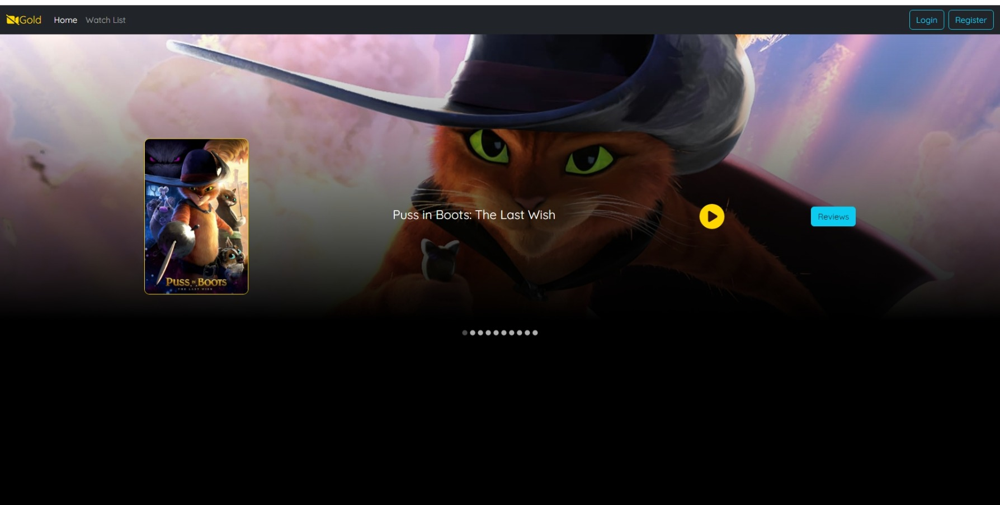
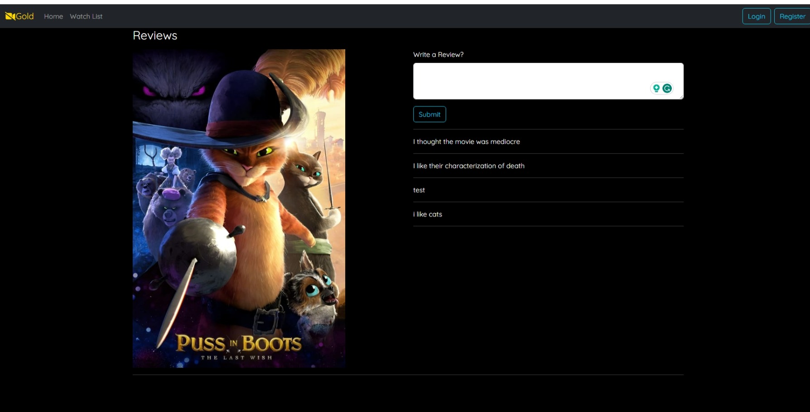

# Live Test Link
https://cq-movie-website.netlify.app/

# movie-website
A full stack project using java, springboot for the backend and react for the front end connected to a mongo database
# how to run
1. Open the backend project
2. connect to the mongodb database using the .env.example
3. run application
4. run frontend cilent
# Future Goals
in the next step, I will try to fully deploy the project so it can be easily viewed on the internet rather than having to be locally ran
